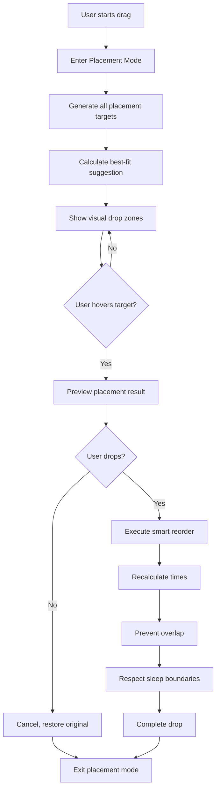

# Drag Placement Suggestion System - Architecture Plan

## Current Implementation Analysis

The Timeline component (`src/components/timeline/Timeline.tsx`) currently has:
- Basic HTML5 drag/drop with `dragIndexRef`, `dragOverIndex`, `dropPreview`
- `handleDragStart`, `handleDragOver`, `handleDragLeave`, `handleDrop`, `handleDragEnd`
- Some preview via `movePreview` and `selectedTargetIndex` for moving block mode
- `shiftBlocksAfterInsertion` for time recalculation

**What's missing:**
1. No "placement suggestion mode" when dragging
2. No clear visual insertion targets
3. No hover preview of results
4. No best-fit suggestion algorithm
5. No forgiving drop zones

---

## Solution Architecture

### 1. New State Management

```typescript
// In Timeline.tsx - new state variables
const [placementMode, setPlacementMode] = useState(false);
const [placementTargets, setPlacementTargets] = useState<PlacementTarget[]>([]);
const [hoveredTarget, setHoveredTarget] = useState<number | null>(null);
const [bestFitTarget, setBestFitTarget] = useState<number | null>(null);
const [dragPreview, setDragPreview] = useState<TimeBlock[] | null>(null);
```

### 2. PlacementTarget Type

```typescript
interface PlacementTarget {
  index: number;
  type: 'before' | 'after' | 'between' | 'gap' | 'end';
  blockId?: string; // adjacent block if applicable
  label: string; // e.g., "Before Lunch", "After Work"
  timeRange?: string; // e.g., "12:00 PM - 1:00 PM"
  isBestFit: boolean;
}
```

### 3. Key Functions to Implement

#### generatePlacementTargets(draggedBlock: TimeBlock, blocks: TimeBlock[])
Generates all possible placement positions:
- Before each block
- After each block  
- In gaps between blocks
- At the end

#### calculateBestFit(draggedBlock: TimeBlock, blocks: TimeBlock[]): number
Algorithm to find best placement based on:
- Available gaps
- Time of day appropriateness
- Duration fit
- Schedule boundaries

#### previewPlacement(targetIndex: number, draggedBlock: TimeBlock): TimeBlock[]
Shows what the schedule will look like after dropping at target

### 4. Visual Components

#### Drop Zone Indicators
- Thin insertion lines between blocks
- Highlighted gap areas
- Ghost placeholder showing dragged block position

#### Hover Preview
- Highlight the target more strongly when hovering
- Show exact resulting time for the block

#### Helper Panel (Optional Side UI)
- Floating panel showing placement options
- Click to select instead of dragging
- "Best fit" badge on recommended option

---

## Implementation Steps

### Step 1: Enhance Timeline State
- Add placement mode state
- Add placement targets array
- Add best fit calculation state
- Add drag preview state

### Step 2: Generate Placement Targets
- Create function to generate targets on drag start
- Calculate gap availability
- Add labels for each target

### Step 3: Implement Best-Fit Algorithm
- Score each potential placement
- Consider: time of day, gap size, duration fit
- Mark best fit in the targets array

### Step 4: Add Visual Drop Zones
- Insert thin lines between blocks
- Highlight gaps as potential drop zones
- Make zones forgiving (larger than pixel-perfect)

### Step 5: Add Hover Preview
- When hovering a target, show preview
- Display resulting time for dragged block
- Show how subsequent blocks shift

### Step 6: Implement Smart Drop
- On drop, use existing shiftBlocksAfterInsertion
- Recalculate all times
- Prevent overlap
- Respect sleep boundaries

### Step 7: Visual Design (Subtle & Premium)
- Soft highlight colors (muted accent)
- Ghost placeholders with low opacity
- Thin insertion lines
- Small helper labels
- No harsh colors or clutter

---

## Mermaid: Drag Flow



---

## Files to Modify

1. `src/components/timeline/Timeline.tsx` - Main implementation
2. `src/components/timeline/TimelineBlock.tsx` - Possibly adjust for drag feedback
3. `src/types/index.ts` - Add PlacementTarget type if needed

---

## Design Guidelines

### Do:
- Use muted accent colors (not bright primary)
- Show subtle ghost placeholders
- Thin insertion lines
- Small helper labels
- Forgiving drop zones (large target areas)
- Smooth animations

### Don't:
- Use harsh bright colors
- Clutter the timeline
- Show too many options at once
- Use alert dialogs
- Make dropping feel fragile